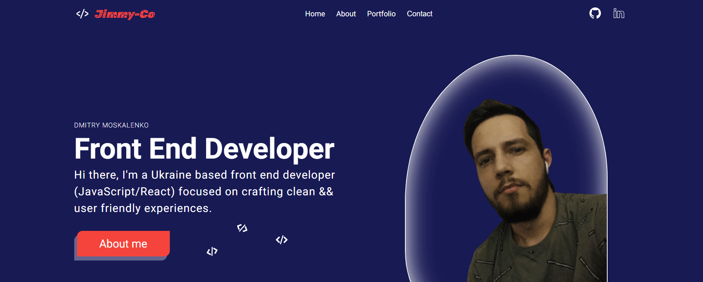

Hi, my name is Dmitry. (JimmyCO (it is my alies :)

My CV-portfolio website.
https://dmitry-moskalenko-portfolio.netlify.app/

or

1. Npm i (install depend)
2. Npm start for start project
3. Npm webpack \*for build

Home - based Info
About - my Cv and certificate
Portfolio - some of my project
Contact - scroll to footer, to my contact

In cv-website used:

1.  React (Hooks / Component)
2.  useRef- for scrolls (Contact/FooterLogo)
    useState / CustomHooks.
3.  Css-Modules / BEM.
4.  Webpack/babel
5.  PropTypes for validation props
6.  i18next change language
